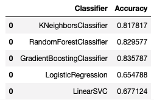

# Persistence B-Spline Grids: Stable Vector Representation of Persistence Diagrams

This is an implementation of Persistence B-Spline Grids on Matlab and Python3. 

## Installation

To run the code, we should install some requirements:
```python
pip install numpy matplotlib scikit-tda tqdm seaborn pandas scikit-learn
```

## Example 1 (toydata)

We support an example of Persistence B-Spline of toydata. It's a simple synthetic toy data set that contained a circle with its radius 0.4, two concentric circles with their radii 0.2 and 0.4, respectively, two disjoint circles with both their radii 0.2, a cluster of points sampled at random in the normal square, and two clusters of points sampled at random separately in two squares with edge length 0,5. All data were sampled in the range of [−0.5, 0.5]^2 on the 2D plane.


1. Run `PD_toydata.ipynb` to generate PDs in `PD_toydata` folder.
2. Run Matlab code `main_toydata.m` to compute PB of PD. The results are saved in `PB_toydata` folder.
3. Run `classify_toydata.ipynb` and see the accuracy of classification.


## Example 2 (3d dynamic system)

Computing PDs takes several hours so you can skip to step3 directly.
1. Run `dynamic_3d.m` in `data` folder to generate original data. 
2. Run `PD_dynamic.ipynb` to generate PDs in `PD_dynamic3d` folder.
3. Run Matlab code `main_dynamic3d.m` to compute PB of PD. The results are saved in `PB_dynamic3d` folder.
4. Run `classify_dynamic3d.ipynb` and see the accuracy of classification.


## Example 3 (PC)

Computing PDs takes several hours so you can skip to step3 directly.
1. original data are in `data/PC_train`
2. Run `PD_pc.ipynb` to generate PDs in `PD_pc` folder.
3. Run Matlab code `main_pc.m` to compute PB of PD. The results are saved in `PB_pc` folder.
4. Run `classify_pc.ipynb` and see the accuracy of classification.

