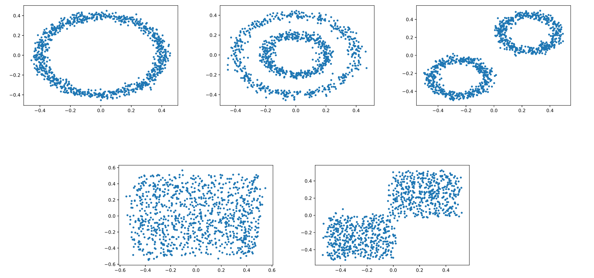
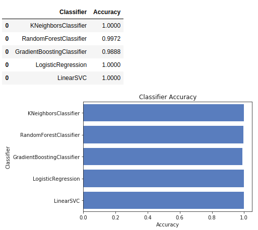
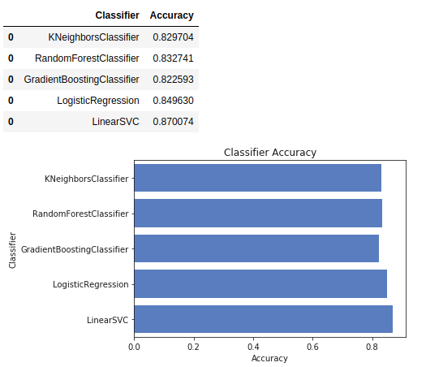

# Persistence B-Spline Grids: Stable Vector Representation of Persistence Diagrams

This is an implementation of Persistence B-Spline Grids on Matlab and Python3. 

## Requirements

To run the code, there are some requirements:
```python
pip install numpy matplotlib scikit-tda tqdm seaborn pandas scikit-learn
```

Jupyter is required to run the `.ipynb`.
The `PB_code` folder should be uploaded.

## Example 1 (toydata)

An example of toydata is provided. It is a simple synthetic toy data set that contains a circle with its radius 0.4, two concentric circles with their radii 0.2 and 0.4, respectively, two disjoint circles with both their radii 0.2, a cluster of points sampled at random in the normal square, and two clusters of points sampled at random separately in two squares with edge length 0,5. All data are sampled in the range of [−0.5, 0.5]^2 on the 2D plane (shown as follows).



Follow the procedures:
1. Run `PD_toydata.ipynb` to generate PDs in `PD_toydata` folder.
2. Run Matlab code `main_toydata.m` to compute PBs. The results are saved in `PB_toydata` folder.
3. Run `classify_toydata.ipynb` and obtain the accuracy of classification shown like the following figure.



## Example 2 (3D dynamical system)

Because computing PDs takes several hours, the PD dataset was computed in advance, and was saved in `PD_dynamic3d` folder. If you wanted to test the algorithm directly, you could skip to step3.

Follow the procedures:
1. Run `dynamic_3d.m` in `data` folder to generate original data. 
2. Run `PD_dynamic.ipynb` to generate PDs in `PD_dynamic3d` folder.
3. Run Matlab code `main_dynamic3d.m` to compute PBs. The results are saved in `PB_dynamic3d` folder.
4. Run `classify_dynamic3d.ipynb` and obtain the accuracy of classification shown like the following figure.



## Example 3 (Randomly-generate PD)

The dataset of randomly-generated PDs was formed to evaluate the method PB: (1) the classification performance of random PDs with randomly marked label to  dispel doubts of over-performance,
and (2) performance on two designed randomly generated PD dataset with different distribution and density of long-persistence points to explain which features of PDs PB can capture.

Follow the procedure:
1. Run `randomPD_test.m` in data folder to generate random PDs with different distribution and density. (Randomly-generated PDs in (1) are given in ./data/randomPD folder.) 
2. Run `main_RandomPD2PB.m` to compute PBs. Data is in PB_ClassifyrandomPD folder and PB_rPD_Evaluation folder.
3. Run `classify_randomPD.ipynb` to obtain the classification accuracy in Test (1) and 
run `classifier_rPD_Evaluation.ipynb` to obtain the results of Test (2).

Experiment in Appendix
## Relationship between stable coefficient and the iteration of LSPIA

The randomly-generated PD dataset is in ./data/PD4theorem folder.
1. Run `iteration_test.m` in data folder to generated PBs.
2. Run `main_ThmCoefTest.m` to generate iteraion-ratio figure.